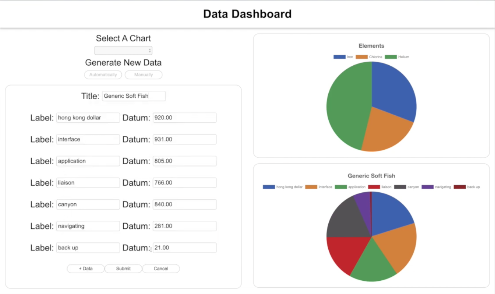

# **Data Dashboard**

[Video demonstration](https://youtu.be/ZVvO2nj2gUw)

React | Node | Express | MongoDB | Mongoose | Chart.js

Customer-facing single-page dashboard for data visualization

- Widget and card user interface with independent scrolling
- Generated data and data structure on back end; applied Chart.js on front end
- Manually enter data and edit data with form widget; POST and PUT endpoints
- Persisted all chart data and user's selected charts with POST and GET endpoints

